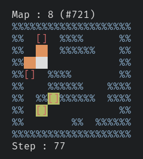

# CSokoban
The game Sokoban, implemented in C for the terminal.
The goal is to use the player character to push the yellow boxes onto all
of the red target squares. No diagonal movements are allowed!



Compile with `make`, and run using `./csokoban`.
Using `./csokoban -s` to shuffle the levels is recommended!
Execute `./csokoban -h` for the following help message.

```
The game Sokoban, implemented in C for the terminal.

usage: csokoban [-hs] [-l mapfile] [-n map_number]
    -h  Show this help message
    -s  Shuffle maps
    -l  Load puzzles from 'mapfile'
    -n  Start from map 'map_number'

keys:
    h j k l     Move the player character left/down/up/right
    4 2 8 6     Same, using the numpad keys
          q     Quit
          r     Restart the current map
        > <     Skip to the next/previous map

```

## Level data
As an example, consider `demolevels.txt`.

```
; 7 5
#######
#@   ##
#  $ x#
##  ###
#######

; 6 7
####
# x#
#  ###
#%@  #
#  $ #
#  ###
####

```

Each map definition starts with a header `; width height`. The next `height` lines
contain tile data, according to the following key.

| Character     |   Tile                        |
|---------------|-------------------------------|
| ` `/`_`       | Empty floor                   |
| `#`           | Wall                          |
| `$`           | Box                           |
| `%`           | Box, already on target square |
| `.`/`x`/`X`   | Target square                 |
| `@`           | Player starting square        |
| `&`           | Player, on a target square    |

You can load this file using `./csokoban -l demolevels.txt`.

The default levels (`levels.txt`) have been taken from [Deepmind's boxoban
levels](https://github.com/deepmind/boxoban-levels), with minor modifications.
To load one of those files, you must first fix the headers, replacing each `;
[number]` with `; 10 10`. This can easily be done with the substitution
`s/;.*$/; 10 10/g`. For instance, use

```
wget https://raw.githubusercontent.com/deepmind/boxoban-levels/master/medium/train/000.txt
sed 's/;.*$/; 10 10/g' 000.txt > levels.txt
```

